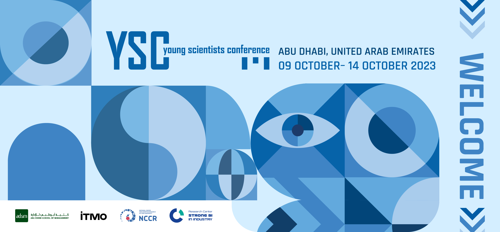

# YSC-2023-Papers

YSC 2023 Papers: A complete collection of research papers, code and data from the [International Young Scientists Conference](https://ysc.actcognitive.org/) for young researchers and professionals in computational science, Artificial Intelligence, Big Data and Machine Learning.

## How to add your presentation

1. Fork this repository
2. In your own copy navigate to "pt" folder
3. On the top right corner click *Add file* and choose *Upload files*
4. Select and upload your file, commit changes directly to the master branch
5. Now let's edit README.md file, find your paper title among the tables
6. Add `` to the column named "Presentation"
7. Don't forget to change `<yourfilename>` to the name of the loaded file, at the end it should look and work like this 
8. Navigate back to [the conference repository](https://github.com/itmo-ai/YSC-2023-Papers/tree/main)
9. Click on *Pull requests* tab and press *New pull request*
10. Click on *compare across forks* and select `head repository: <yourusername>/YSC-2023-Papers`
11. You should see your changes, let's press *Create pull request*
12. Name your PR reasonable and add comments if necessery
13. On the right panel press on *Reviewers* and select **DRMPN**
14. Press *Create pull request* and wait for approval

## Papers

List of sections

- [Computing infrastructure](#computing-infrastructure)

- [Data Analysis and NLP](#data-analysis-and-nlp)

- [Deep Learning and Data-Driven Modelling](#deep-learning-and-data-driven-modelling)

- [Healthcare](#healthcare)

- [Optimisation and Scheduling](#optimisation-and-scheduling)

- [Urban studies and town planning](#urban-studies-and-town-planning)

## Computing infrastructure

 
|  ID  | Title                                                                                  |                                                             Links                                                             |  Presentation  |
|:----:|:---------------------------------------------------------------------------------------|:-----------------------------------------------------------------------------------------------------------------------------:|:--------------:|
|  14  | Framework architecture of a secure big data lake                                       |  |                |
|  49  | Combination of parallelization and skewed tiling                                       |                                                                                                                               |                |
|  50  | Automatic mapping of sequential programs to parallel computers with distributed memory |                                                                                                                               |                |

[Back to top](#papers)

## Data Analysis and NLP

 
|  ID  | Title                                                                                                                                                      |                                                                                   Links                                                                                    |  Presentation  |
|:----:|:-----------------------------------------------------------------------------------------------------------------------------------------------------------|:--------------------------------------------------------------------------------------------------------------------------------------------------------------------------:|:--------------:|
|  33  | Semi-supervised method for improving general-purpose and domain-specific textual corpora labels                                                            |                                                                                                                                                                            |                |
|  54  | Analyzing Proficiency Patterns in Test Results Using Clustering and Augmentation Algorithms                                                                |                                                            |                |
|  59  | Generative approach to Aspect Based Sentiment Analysis with GPT Language Models                                                                            |                                                                                |                |
|  60  | An Approach to Automate the Scientific Paper’s Evaluation Based on NLP Technologies: the Experience in the Russian Segment of Financial Technologies Field |   |                |
|  71  | Interpretable Embeddings for Geographic Transactional Activity Analysis                                                                                    |                                                                                                                                                                            |                |
|  72  | AI-Based Human Resource Management Tools and Techniques; A Systematic Literature Review                                                                    |                                                                                                                                                                            |                |

[Back to top](#papers)

## Deep Learning and Data-Driven Modelling

 
|  ID  | Title                                                                                                                           |                                                                                                                                             Links                                                                                                                                             |  Presentation  |
|:----:|:--------------------------------------------------------------------------------------------------------------------------------|:---------------------------------------------------------------------------------------------------------------------------------------------------------------------------------------------------------------------------------------------------------------------------------------------:|:--------------:|
|  06  | Light-weight ensembling of deep neural models for object recognition in remote sensing data                                     |                                                               |                |
|  15  | Convolutional Neural Network Graph-based Embedding for Neural Architecture Search                                               |                                                                                                                                                                                      |                |
|  16  | FAMLINN: Representation for Storing Neural Network Architecture                                                                 |                                                                                                                                                                                                 |                |
|  18  | Multimodal prediction of profanity based on speech analysis                                                                     |                                                                                                                                                                                     |                |
|  24  | Proactive selection of machine learning models for small sample sizes in cerebral stroke detection based on PAC-learning theory |                                                                                                                                                                           |                |
|  31  | CIS Multilingual License Plate Detection and Recognition Based on Convolutional and Transformer Neural Networks                 |                                                                                                                  |                |
|  32  | Predicting dataset size for neural network fine-tuning with a given quality in object detection task                            |                                                                                                                                                                               |                |
|  35  | Forecasting of Sea Ice Concentration using CNN, PDE discovery and Bayesian Networks                                             |                                                                                                                                                                   |                |
|  45  | mHAR: a novel convolutional recurrent model for recognizing motion-based human activity                                         |   |                |
|  57  | Development of domain-specific automatic speech recognition models based on open-source data                                    |                                                                                                                                                                                                                                                                                               |                |
|  61  | Ontological model identification based on data from heterogeneous sources                                                       |                                                                                                                                                                                                                                                                                               |                |
|  63  | Investigation of optimal parameters in multiagent dynamical system                                                              |                                                                                                                                                                                                                                                                                               |                |
|  65  | Adaptive Fusion and Transfer Learning for Enhanced E –Commerce Recommendations                                                  |                                                                                                                                                                     | |

[Back to top](#papers)

## Healthcare

 
|  ID  | Title                                                                                                  |                                                                                                                                                         Links                                                                                                                                                          |  Presentation  |
|:----:|:-------------------------------------------------------------------------------------------------------|:----------------------------------------------------------------------------------------------------------------------------------------------------------------------------------------------------------------------------------------------------------------------------------------------------------------------:|:--------------:|
|  05  | Gravity influence in one-dimensional blood flow modeling                                               |                                                                                                                                                                                                       |                |
|  26  | Methodology of event extraction from unstructured medical texts on the example of the Russian language |                                                                                                                                                                                                                                                                                                                        |                |
|  52  | Mobile application BioScan for determining the level of food safety                                    |                                                                                                                                                                                                                                                                                                                        |                |
|  58  | Predictive modeling of multistep clinical pathways: application to infertility treatment process       |                                                                                                                                                                                                                                                                                                                        |                |
|  62  | Interpretable Early Prediction of Sepsis Based on Counterfactual Inference                             |   |                |

[Back to top](#papers)

## Optimisation and Scheduling

 
|  ID  | Title                                                                                            |                                                Links                                                 |  Presentation  |
|:----:|:-------------------------------------------------------------------------------------------------|:----------------------------------------------------------------------------------------------------:|:--------------:|
|  12  | Hybrid Algorithm for Multi-Contractor, Multi-Resource Project Scheduling in the Industrial Field |                                                                                                      |                |
|  23  | Automated Generation of Ensemble Pipelines using Policy-Based Reinforcement Learning method      |                                                                                                      |                |
|  27  | Mutation Management for Evolutionary Small-Moves Approach in Pickup and Delivery Problem         |  |                |
|  39  | Determination of Optimal Locations for ATM Network Service Points                                |                                                                                                      |                |
|  43  | Crisis Behaviour Strategy Recognition Using Transactional Data                                   |                                                                                                      |                |

[Back to top](#papers)

## Urban studies and town planning

 
|  ID  | Title                                                                                                                      |                                                                      Links                                                                      |  Presentation  |
|:----:|:---------------------------------------------------------------------------------------------------------------------------|:-----------------------------------------------------------------------------------------------------------------------------------------------:|:--------------:|
|  25  | A method for automatically identifying vacant area in the current urban environment based on open source data              |                                                    |                |
|  28  | Urban blocks modelling method                                                                                              |  |                |
|  29  | ClarTM: a method for geolocations clarification within extensive urban sites using topic modelling                         |                                                                                                                                                 |                |
|  30  | Feedback2Event: Public attention event extraction from spontaneous data for urban management                               |           |                |
|  37  | Estimating the attractiveness of the city for skilled workers using jobs-housing matching, spatial data and NLP techniques |                                                                                                                                                 |                |
|  64  | Generating of synthetic datasets using diffusion models for solving computer vision tasks in urban applications            |                                                                                                                                                 |                |

[Back to top](#papers)
